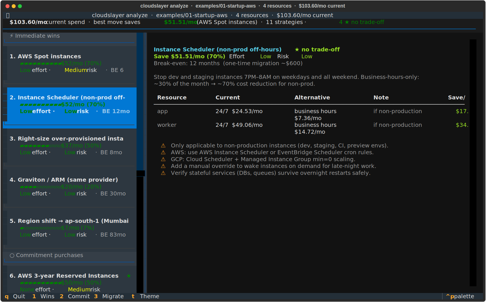
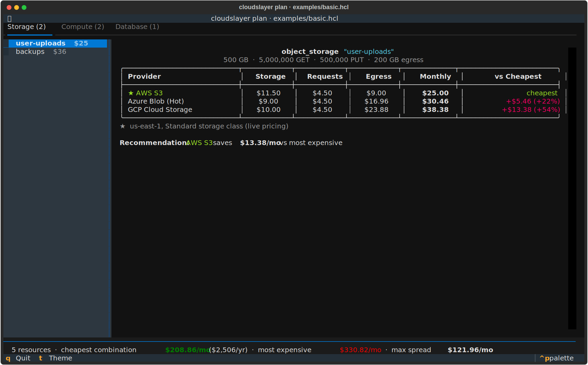

<p align="center">
  
</p>

```
 ██████╗██╗      ██████╗ ██╗   ██╗██████╗
██╔════╝██║     ██╔═══██╗██║   ██║██╔══██╗
██║     ██║     ██║   ██║██║   ██║██║  ██║
██║     ██║     ██║   ██║██║   ██║██║  ██║
╚██████╗███████╗╚██████╔╝╚██████╔╝██████╔╝
 ╚═════╝╚══════╝ ╚═════╝  ╚═════╝ ╚═════╝
███████╗██╗      █████╗ ██╗   ██╗███████╗██████╗
██╔════╝██║     ██╔══██╗╚██╗ ██╔╝██╔════╝██╔══██╗
╚█████╗ ██║     ███████║ ╚████╔╝ █████╗  ██████╔╝
 ╚══██╗ ██║     ██╔══██║  ╚██╔╝  ██╔══╝  ██╔══██╗
██████╔╝███████╗██║  ██║   ██║   ███████╗██║  ██║
╚═════╝ ╚══════╝╚═╝  ╚═╝   ╚═╝   ╚══════╝╚═╝  ╚═╝

  ⚔  slay your cloud bill — AWS · GCP · Azure  ⚔
```

[](https://github.com/cloudslayer-dev/cloudslayer/actions/workflows/ci.yml)
[](https://pypi.org/project/cloudslayer)
[](https://www.python.org)
[](LICENSE)

**cloudslayer** is an open-source FinOps CLI that answers two questions Infracost doesn't:

> _"Where should this workload run — AWS, GCP, or Azure?"_
> _"What should I change first to cut the bill?"_

It maps your infrastructure to **equivalent** resources on all three major clouds (`t3.medium` ↔ `e2-medium` ↔ `Standard_B2s`), prices them from official pricing APIs, and runs a strategy engine that surfaces cost-saving moves sorted by impact and practicality — immediate wins first, big migrations last.

## How is this different from Infracost?

[Infracost](https://github.com/infracost/infracost) tells you what your Terraform costs *on the cloud it's written for*. cloudslayer tells you what the equivalent setup costs *on every major cloud*, plus what to change (Graviton, spot, scheduling, reserved instances, storage tiering, region shifts). Different questions — they work great together:

|                                | Infracost | cloudslayer |
|--------------------------------|:---:|:---:|
| Price the exact resources in a plan | ✅ (1,100+ resource types) | ✅ (core cost drivers) |
| Cross-cloud equivalence comparison | ❌ | ✅ |
| Cost-saving strategy recommendations | ❌ | ✅ |
| Works before any cloud account exists | ❌ | ✅ (spec mode) |

## Features

- **Cross-cloud comparison** — compute, managed PostgreSQL, object storage, and serverless functions on AWS, GCP, and Azure
- **Terraform scanner** — reads `.tf` files directly, or a `terraform show -json` plan for full module/variable/count resolution
- **Strategy engine** — 15+ strategies (Graviton, Reserved Instances, Savings Plans, Spot, Instance Scheduler, Storage Lifecycle, …) with Pareto-dominant detection
- **Honest coverage** — tells you exactly which detected resources are and aren't included in the estimate
- **Live pricing** — AWS (Bulk Pricing API) and Azure (Retail Prices API) fetched live and cached 7 days; GCP verified monthly
- **Interactive TUI** — navigate strategies and comparisons with the keyboard, powered by [Textual](https://github.com/Textualize/textual)
- **CI/CD ready** — `--format markdown` for PR comments, `--fail-if-over` budget gates, cost diff between branches

## Install

```bash
pip install cloudslayer
# or (recommended)
uv tool install cloudslayer
```

For live-account scanning (`cloudslayer actual`):

```bash
pip install "cloudslayer[aws]"    # boto3 for EC2/RDS live data
pip install "cloudslayer[gcp]"    # google-cloud-compute
pip install "cloudslayer[azure]"  # azure-mgmt-compute
pip install "cloudslayer[all]"    # everything
```

## Quick start

### 1. Write a spec (HCL — same syntax as Terraform)

```hcl
# infra.hcl

compute "api" {
  vcpu      = 2
  memory_gb = 4
}

object_storage "uploads" {
  storage_gb   = 500
  get_requests = 5000000
  put_requests = 500000
  egress_gb    = 200
}

database "main-db" {
  vcpu       = 2
  memory_gb  = 4
  storage_gb = 20
  engine     = "postgres"
}
```

### 2. Compare across AWS, GCP, and Azure

```bash
cloudslayer plan infra.hcl
```

```
────────────── cloudslayer  multi-cloud cost comparison ──────────────

  compute "api"  ·  2 vCPU · 4 GB RAM

  ★ GCP Compute Engine        e2-medium      $24.11/mo   cheapest
    AWS EC2                   t4g.medium     $24.53/mo   +$0.42 (+2%)
    Azure VM                  Standard_B2s   $30.37/mo   +$6.26 (+26%)

  database "main-db"  ·  2 vCPU · 4 GB RAM · 20 GB storage

  ★ Azure DB for PostgreSQL   Standard_B2s      $27.12/mo   cheapest
    AWS RDS                   db.t4g.medium     $47.45/mo   +$20.33 (+75%)
    GCP Cloud SQL             db-n1-standard-2  $94.84/mo   +$67.72 (+250%)

  object_storage "uploads"  ·  500 GB · 200 GB egress

  ★ AWS S3                    $25.00/mo   cheapest
    Azure Blob (Hot)          $30.46/mo   +$5.46 (+22%)
    GCP Cloud Storage         $38.38/mo   +$13.38 (+54%)

  ─────────────── Total Infrastructure Summary ───────────────

  Cheapest combination:      $76.23/mo    ($915/yr)
  Most expensive combo:     $163.59/mo  ($1,963/yr)
```

No single cloud wins everything — that's the point.

## Already on a cloud? Scan your Terraform

```bash
# Zero setup: scan raw .tf files
cloudslayer scan ./terraform/
cloudslayer compare ./terraform/       # your current spend vs the other two clouds
cloudslayer analyze ./terraform/       # full cost-saving strategy analysis

# Full accuracy: use a resolved plan (modules, variables, count, for_each)
terraform plan -out=plan.out && terraform show -json plan.out > plan.json
cloudslayer analyze plan.json
```

cloudslayer detects `aws_instance`, `aws_db_instance`, `aws_s3_bucket`, `aws_lambda_function`, `google_compute_instance`, `azurerm_linux_virtual_machine`, and more — and maps instance types (`t3.medium → 2 vCPU / 4 GB`) automatically.

It also tells you what it *couldn't* price, so the estimate is never silently wrong:

```
Resources: 4 costed · 2 detected but not costed yet · 3 with no direct cost (IAM, networking, DNS, ...)
  • aws_nat_gateway.nat   NAT Gateway (~$32.85/mo + $0.045/GB processed)
  • aws_eks_cluster.k8s   EKS control plane (~$73/mo)
Cost estimates below exclude these resources.
```

## Strategy engine

`cloudslayer analyze` runs your infrastructure through 15+ strategy generators and presents them in **three priority tiers** — immediate wins first:

```bash
cloudslayer analyze ./terraform/
```

```
── cloudslayer analyze  ·  4 resources  ·  $103.60/mo current ──

──────── Immediate wins  (no commitment, quick to implement) ────────

  Strategy 1 · Instance Scheduler (non-prod off-hours)  ★ no trade-off
  Save $51.51/mo (70%)    Effort Low    Risk Low   break-even 12 mo
  Stop dev/staging 7PM–8AM + weekends → 70% cost cut for non-prod.

  Strategy 2 · Right-size over-provisioned instances
  Save $36.80/mo (50%)    Effort Low    Risk Low   break-even 8 mo
  If avg CPU < 40%, cut the instance in half.

  Strategy 3 · Graviton / ARM (same provider)
  Save $20.08/mo (20%)    Effort Low    Risk Low   break-even 30 mo
  Drop-in ARM replacement. Change the instance type and redeploy.

  ── Commitment purchases  (lock-in required, zero migration) ────────

  Strategy 6 · AWS 3-year Compute Savings Plans  ★ no trade-off
  Save $52.20/mo (50%)    Effort None    Risk Medium
  Like RIs but cross-family — discount survives a Graviton migration.

  ──── Major migrations  (high effort, biggest savings potential) ─────

  Strategy 9 · Full provider migration
  Save $47.90/mo (46%)    Effort High    Risk High
  Move each resource to its cheapest equivalent on GCP/Azure.
```

**Dominant strategies** (★) are Pareto-non-dominated — no other strategy simultaneously beats them on savings, effort, and risk. Pick one of these and you're making no trade-off at all.

## Interactive TUI

Add `--interactive` to any command to launch a split-panel terminal UI:

```bash
cloudslayer analyze ./terraform/ --interactive
cloudslayer plan infra.hcl --interactive
cloudslayer compare ./terraform/ --interactive
```





Navigate with arrow keys or `j`/`k`, jump tiers with `1`/`2`/`3`, `Tab` to switch panels, `t` to toggle light/dark, `q` to quit.

## CI/CD integration

Generate a GitHub Actions workflow that posts cost comparisons on every PR that touches your infrastructure:

```bash
cloudslayer init
# writes .github/workflows/cloudslayer.yml
```

On every pull request touching `.tf` or `.hcl` files, cloudslayer compares the base branch vs the PR branch and posts a diff comment with the exact cost impact. For custom pipelines:

```bash
cloudslayer plan infra.hcl --format markdown   # GitHub-flavored tables for PR comments
cloudslayer plan infra.hcl --format json       # machine-readable
cloudslayer plan infra.hcl --fail-if-over 500  # exit 2 if cheapest combo > $500/mo
cloudslayer diff before.hcl after.hcl          # cost delta between two specs
```

## Supported providers

All prices are for `us-east-1` / `East US` / `us-east1` by default — change with `--region`.

### Compute

| Provider           | 2 vCPU / 4 GB | 4 vCPU / 16 GB | Pricing source |
|--------------------|--------------:|---------------:|----------------|
| GCP Compute Engine |     $24.11/mo |      $96.14/mo | Verified monthly |
| AWS EC2            |     $24.53/mo |      $98.11/mo | Live (Bulk Pricing API) |
| Azure VM           |     $30.37/mo |     $121.18/mo | Live (Retail Prices API) |

### Managed PostgreSQL

| Provider                | 2 vCPU / 4 GB / 20 GB | Pricing source |
|-------------------------|----------------------:|----------------|
| Azure DB for PostgreSQL |             $27.12/mo | Live (Retail Prices API) |
| AWS RDS                 |             $47.45/mo | Live (Bulk Pricing API) |
| GCP Cloud SQL           |             $94.84/mo | Verified monthly |

### Object storage

| Provider          | Storage   | Egress    | Pricing source |
|-------------------|-----------|-----------|----------------|
| Azure Blob (Hot)  | $0.018/GB | $0.087/GB | Live (Retail Prices API) |
| GCP Cloud Storage | $0.020/GB | $0.120/GB | Verified monthly |
| AWS S3            | $0.023/GB | $0.090/GB | Live (Bulk Pricing API) |

### Serverless functions

| Provider            | 1M invocations @ 128 MB / 200ms |
|---------------------|--------------------------------:|
| AWS Lambda          |                           $0.02 |
| GCP Cloud Functions |                           $0.04 |
| Azure Functions     |                           $0.04 |

Run `cloudslayer providers` to see live sources and last-verified dates.

## All commands

| Command                                  | Description                                          |
|------------------------------------------|------------------------------------------------------|
| `cloudslayer plan <file.hcl>`                | Compare costs across AWS, GCP, Azure from an HCL spec |
| `cloudslayer compare <tf-dir \| plan.json>`  | Compare current cloud spend vs the alternatives      |
| `cloudslayer analyze <tf-dir \| plan.json>`  | Run strategy engine — full cost-saving analysis      |
| `cloudslayer diff <before.hcl> <after.hcl>`  | Show cost impact of infra spec changes               |
| `cloudslayer scan <tf-dir \| plan.json>`     | Detect and list cloud resources                      |
| `cloudslayer scan <dir> --generate-spec`     | Generate a cloudslayer HCL spec from Terraform           |
| `cloudslayer actual <aws \| gcp \| azure>`   | Actual spend (requires cloud credentials)            |
| `cloudslayer init`                           | Generate GitHub Actions workflow                     |
| `cloudslayer providers`                      | List providers, pricing sources, last-verified dates |
| `cloudslayer cache status \| clear`          | Manage the local pricing cache                       |

Add `--interactive` to `plan`, `compare`, or `analyze` for the TUI, `--region` to price a different region, `--format json|markdown` for machine-readable output.

## Strategy engine — full list

**Tier 1 — Immediate wins** (no commitment, deploy and save)

| Strategy                      | Typical saving | Effort | Risk   |
|-------------------------------|---------------:|--------|--------|
| Graviton / ARM                | 10–20%         | Low    | Low    |
| Right-size over-provisioned   | 25–50%         | Low    | Low    |
| Instance Scheduler (non-prod) | 60–70%         | Low    | Low    |
| Storage lifecycle rules       | 20–40%         | Low    | Low    |
| Region shift                  | 5–7%           | Low    | Low    |
| AWS Spot / GCP Preemptible    | 60–80%         | Low    | Medium |

**Tier 2 — Commitment purchases** (no migration, just buy)

| Strategy                      | Typical saving | Effort | Risk   |
|-------------------------------|---------------:|--------|--------|
| AWS Reserved Instances (1/3yr)| 30–50%         | None   | Low–Med|
| AWS Compute Savings Plans     | 33–50%         | None   | Low–Med|
| GCP Committed Use Discounts   | 20–37%         | None   | Low–Med|
| Azure Reserved VM Instances   | 28–45%         | None   | Low–Med|
| Balanced commitment portfolio | ~31%           | Low    | Low    |

**Tier 3 — Major migrations** (high effort, big payoff)

| Strategy                      | Typical saving | Effort | Risk   |
|-------------------------------|---------------:|--------|--------|
| Full provider migration       | 30–60%         | High   | High   |

## Pricing accuracy

AWS and Azure prices are fetched live from official pricing APIs and cached for 7 days (`cloudslayer cache status`). GCP prices are hardcoded with verified dates. Every resource comparison shows its pricing source, and `cloudslayer scan` lists any detected resources that are *not* included in the estimate.

> **Disclaimer:** Prices are estimates for planning purposes. Always verify against official provider pricing pages before making commitments. Actual bills depend on usage patterns, negotiated discounts, support tiers, data transfer, and region.

## Contributing

Issues and PRs welcome — resource-type coverage (NAT gateways, load balancers, EBS/managed disks, node groups) is the current focus and a great first contribution.

```bash
git clone https://github.com/cloudslayer-dev/cloudslayer
cd cloudslayer
uv sync --extra dev
uv run cloudslayer plan examples/basic.hcl   # smoke test
uv run pytest                            # run the test suite
```

See [CONTRIBUTING.md](CONTRIBUTING.md) for the provider and strategy authoring guides.

## License

[Apache 2.0](LICENSE) — free to use, modify, and distribute.
